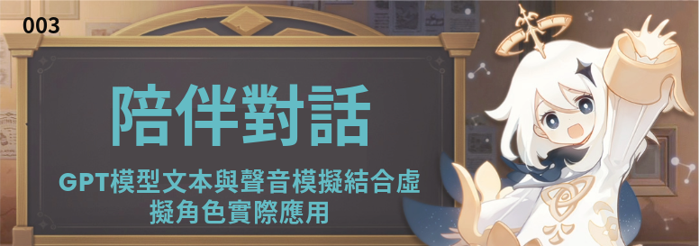
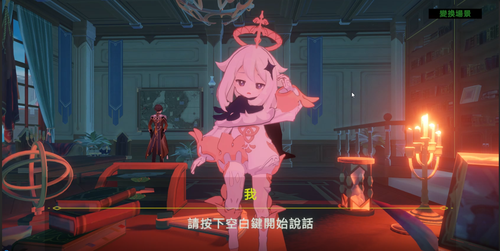

# Companion Conversations: Integrating GPT Model Text and Voice Simulation with Practical Applications in Virtual Characters

Introduction:

In this project, we introduce a character from a game, Paimon, along with its personality traits. Through character setup, the project goes beyond a typical GPT chatbot. We have also endowed it with visual and auditory features, making the interaction with it more engaging and lively.

Motivation:

The motivation comes from a past experience during high school. A friend, feeling lonely due to family problems, was reluctant to share their feelings with others, ultimately impacting their mental well-being.

Target Audience:

We aim for users to express their emotions openly, providing them with an outlet for emotional release. This is not only applicable to individuals with mental health issues but also suitable for those who struggle with social interactions.

# Pre-requisites
1.Python >= 3.9

2.Clone this repository

3.Install python requirements. Please refer requirements.txt

4.Build Monotonic Alignment Search and run preprocessing 

```
# Cython-version Monotonoic Alignment Search
cd TTS/monotonic_align
python setup.py build_ext --inplace
```
5.Download Models and Unity Package：[https://drive.google.com/drive/folders/1b_FhTX_CHuo_6bpp4Aghgsr1zjIKxP8H?usp=sharing](https://drive.google.com/drive/folders/1b_FhTX_CHuo_6bpp4Aghgsr1zjIKxP8H?usp=sharing)

6.Modify paths and API keys

7.Replace the code of revChatbot V3 with the content of the txt file

# Usage

1.Run Unity

2.Run chatbotAPI.py

# Demo Video

[](https://www.youtube.com/watch?v=YOUTUBE_VIDEO_ID_HERE)
